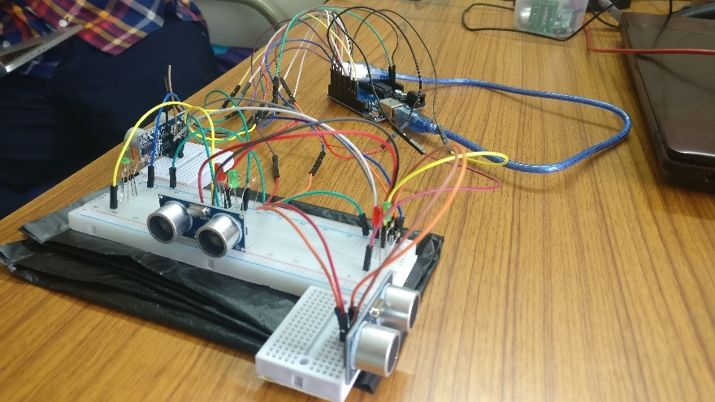

# Density-Based-Traffic-Control-System-
This is an arduino based project showing how to control traffic based on its density. 

Nowadays, controlling the traffic has become a major issue because of rapid increase in automobiles and also because of large time delays between traffic lights. So, in order to rectify this problem, we have gone for density based traffic lights system. 

This project requires an Arduino and Ultrasonic sensors.

Initially, the circuit used IR sensors to detect density. It was found that analog data cannot be read. The circuit was then modified by replacing the IR sensors with Ultrasonic sensors

In this system, we use Ultrasonic sensors to measure the traffic density. We have arranged one Ultrasonic sensor for each road; these sensors always sense the traffic on that particular road. All these sensors are interfaced to the microcontroller(ATMEGA328P). Based on these sensors, microcontroller detects the density and controls the traffic system.

